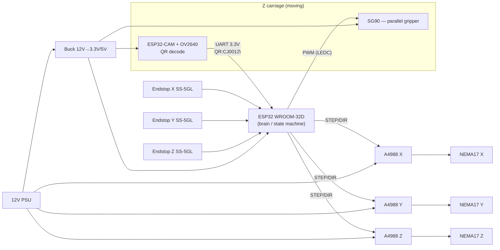

# Implementation Plan — XYZ Gantry Pick & Place Robot with QR Sorting

> Cartesian 3-axis robot (linear screw actuators + NEMA 17) that picks small boxes from a feed zone, scans their QR code with an ESP32-CAM mounted on the gripper, and sorts them onto shelves based on the destination encoded in the QR (e.g. `MS`, `BV`, `CJ`).

This file is the project's working spec / context document for the build. Level: advanced. It assumes you can solder, flash an ESP32, and know Arduino basics. It focuses on architecture, design decisions, and implementation steps — not introductory concepts.

---

## 1. System architecture

Two microcontrollers, clear separation of responsibilities:

- **ESP32-CAM (AI-Thinker) = vision node.** Its only job: capture the image, decode the QR (quirc), send the decoded string over UART to the brain. It controls nothing mechanical. A "smart sensor" on the gripper.
- **ESP32-DevKitC (WROOM-32D) = the brain.** Receives the QR string over serial, runs the state machine, generates step pulses for the 3 steppers through the A4988 drivers, homes on the endstops, drives the gripper's SG90 servo, and decides the destination shelf.



**Why two boards and not one:** the ESP32-CAM has nearly all pins taken by the OV2640 camera + PSRAM, so it can't also drive 3 steppers + endstops. QR decoding with quirc is also CPU/RAM heavy — you want the motion loop (timing-critical) to never be blocked by image processing. The split is architecturally correct.

---

## 2. Key design decisions (read before ordering parts)

### 2.1 A4988 vs DRV8825 for a 1.7 A NEMA 17 — caution
The motor label says **1.7 A / phase**. The A4988 realistically delivers ~1 A without a heatsink and ~1.4–1.5 A with a heatsink + airflow; 2 A is the absolute theoretical limit. You will therefore run the motors **under-current** (~1.0–1.2 A), which reduces torque. For a light pick & place (small boxes, moderate speeds) that's acceptable, but:

- **Recommendation:** if you want torque/speed margin, swap the A4988 for a **DRV8825** (up to 2.2 A, 1/32 microstepping, pin-compatible on most StepStick modules). Same cost. If you stick with the A4988 (as requested), put a heatsink on each driver and accept reduced current.
- Current is set via **Vref** (see §6.2 / Phase 2). Do not skip this step — an untuned A4988 means lost steps or burned drivers.

### 2.2 Powering the ESP32-CAM — failure source #1 (brownout)
The ESP32-CAM draws current peaks when the camera/Wi-Fi start (300–500 mA, higher spikes). A weak buck → brownout → boot loop.

- **For the brain (WROOM-32D):** a 12V→3.3V buck into the `3V3` pin is fine (bypasses the onboard LDO). Alternatively 12V→5V into `5V/VIN`.
- **For the ESP32-CAM:** **prefer 12V→5V** in a dedicated buck, connected to the module's `5V` pin (uses the onboard AMS1117 LDO, which handles inrush better). If you insist on 3.3V directly (as requested), use a **≥1 A** buck and add a **470–1000 µF electrolytic + 100 nF ceramic** capacitor right next to the CAM's power pins. Do not power the CAM on both 5V and 3V3 at the same time.
- Common ground (GND) is mandatory between the two bucks, the two ESP32s, and the 12V PSU. Otherwise UART won't work.

### 2.3 QR decoding on the ESP32-CAM — realistic, but with limits
The ESP32-CAM with the `ESP32QRCodeReader` library (quirc-based) works, but the OV2640 has **fixed focus** (~10–25 cm usable range) and is light-sensitive. For reliability:

- QR codes **printed clearly, high contrast**, at least ~25×25 mm at the chosen scan distance.
- Add **illumination** (the GPIO4 LED is too strong/close; a small diffuse side LED is better).
- Fixed camera-to-box distance (the gripper always brings the camera to the same scan position → constant focus).
- Working resolution: `FRAMESIZE_QVGA`/`VGA` is enough for QR; larger = slower.

**More robust alternatives (optional, if QR-on-CAM is troublesome):**
- **Useful Sensors Tiny Code Reader** — I2C module, decodes QR onboard, sends the string directly. Zero processing on the ESP32. Simplest.
- **GM65 / GM861 barcode scanner** — UART module, very reliable, also reads 1D codes. Use it in place of the ESP32-CAM and wire UART straight to the brain.

Recommendation: start with the ESP32-CAM (it's what you have), but if the read rate is below ~90%, switch to the Tiny Code Reader. The serial protocol in §8 stays identical, only the source of the string changes.

### 2.4 Who controls the SG90 gripper
Recommendation: the **brain** drives the SG90 (PWM via LEDC), not the ESP32-CAM. All motion logic (open/close synchronized with the Z descent) stays in one place → clean state machine. Cost: one extra signal wire through the drag chain to the carriage. Worth it.

### 2.5 Stepper voltage 12V
At 12V, the NEMA 17 gives good torque at low–medium speeds; at high speeds torque drops (coil inductance). Fine for pick & place. If you later want speed, the A4988/DRV8825 support up to 35V/45V on the motor — you could move the motors to 24V while keeping the logic on 12→3.3V. For now we stay at 12V per your parts list.

---

## 3. Bill of materials

**Already have (from the brief):**

| Component | Role | Qty |
|---|---|---|
| Linear screw actuator + NEMA17 | X, Y, Z axes | 3 |
| NEMA 17 (1.7 A, 1.8°, 42×42×40) | Stepper motors | 3 (in actuators) |
| A4988 driver | Stepper control | 3 |
| SS-5GL mechanical endstop (5A 125VAC) | Homing / limit | 3 (min.) |
| 12V PSU | Power | 1 |
| ESP32-CAM + ESP32-CAM-MB (HW-381) | Vision / QR | 1 |
| SG90 servo | Gripper actuation | 1 |
| Parallel gripper (GrabCAD) | Box grasping | 1 |
| ESP32-DevKitC WROOM-32D | Brain | 1 |
| Buck 12V→3.3V | Logic power | 1–2 |

**To add (required, not in the list):**

- **Heatsinks** for the 3 A4988s (mandatory at this current).
- **100 µF / 35V electrolytic capacitors** on each A4988's VMOT input (protects the driver from spikes — the driver can burn out without them). Plus 470–1000 µF on the ESP32-CAM power.
- **Dedicated 12V→5V buck** for the ESP32-CAM (see §2.2). Recommended separate from the brain's.
- **6 endstops** if you also want end (max) limits, not just homing (min). Minimum 3 for homing.
- **Drag chain (cable carrier)** + flexible wire for the cabling to the moving Z carriage.
- **Connectors** (Dupont/JST), **terminal block**, **fuse** on the 12V (e.g. 5A).
- **Frame / extrusion** for the orthogonal mounting of the 3 actuators (see §5.1) if the actuators don't come with a mounting kit.
- **Correctly sized 12V PSU:** 3× ~1.2A (steppers) + camera/logic ≈ **minimum 5A, recommended 6–8A** with margin.

---

## 4. Electrical architecture & pin map

### 4.1 Power distribution
```
12V PSU ────┬── VMOT A4988 x3 (+ 100µF cap each)
            ├── Buck 12V→3.3V ── 3V3 ESP32 WROOM (brain)
            └── Buck 12V→5V   ── 5V ESP32-CAM (+ 470µF cap)
Common GND for EVERYTHING.
```

### 4.2 Pin map — ESP32 WROOM-32D (brain)
Intentionally avoided: GPIO 0/2/12/15 (strapping), 6–11 (flash SPI), 34–39 (input-only).

| Function | GPIO | Notes |
|---|---|---|
| X STEP | 25 | |
| X DIR | 26 | |
| Y STEP | 32 | |
| Y DIR | 33 | |
| Z STEP | 27 | |
| Z DIR | 14 | |
| ENABLE (shared across all 3 A4988) | 13 | active LOW |
| Endstop X | 21 | `INPUT_PULLUP`, contact to GND |
| Endstop Y | 22 | `INPUT_PULLUP` |
| Endstop Z | 23 | `INPUT_PULLUP` |
| Servo SG90 (PWM) | 19 | LEDC channel, 50 Hz |
| UART2 RX (from CAM) | 16 | `Serial2` |
| UART2 TX (trigger to CAM, optional) | 17 | |
| Status LED (optional) | 2 | strapping — LED output only |

**MS1/MS2/MS3** (microstepping) — **NOT** on GPIO; set them with jumpers on the A4988 board (e.g. all HIGH = 1/16). Saves 9 pins.

### 4.3 Pin map — ESP32-CAM (AI-Thinker)
Camera + PSRAM take most pins. Usable free: GPIO 12, 13, 14, 15, 2, 4, 16. **Strapping caution:** GPIO12 must be LOW at boot, 15 and 2 have constraints.

| Function | GPIO | Notes |
|---|---|---|
| UART TX → brain (`QR:...`) | 13 | the important direction (CAM→brain) |
| "Scan now" trigger ← brain | 14 | input; or continuous scan (see §8) |
| (Optional illumination LED) | 4 | onboard white LED — bright, use briefly |

> Do not use GPIO12 as TX (idle = HIGH would block boot). That's why the CAM's TX is on GPIO13. Connect **common GND** between CAM and brain — both are 3.3V logic, so UART direct, no level shifter.

### 4.4 A4988 wiring (per driver)
```
VMOT, motor-GND ── 12V (+ 100µF cap)
VDD, logic-GND  ── 3.3V from brain
STEP, DIR       ── brain GPIO (table 4.2)
ENABLE          ── shared GPIO13
RESET ── SLEEP   (tied together, to VDD)
1A,1B,2A,2B     ── motor coils (verify pairs with an ohmmeter!)
MS1/MS2/MS3     ── microstepping jumpers
```

---

## 5. Mechanics, coordinate system and kinematics

### 5.1 Orthogonal mounting
Typical cartesian gantry layout:
- **Y axis** (or X) — the base actuator, long, defines the table length.
- **X axis** — mounted perpendicular on the Y carriage (the gantry bridge).
- **Z axis** — mounted vertically on the X carriage; the gripper + ESP32-CAM sit on the Z carriage.

The load on Z (gripper + SG90 + ESP32-CAM + cabling) must stay below the Z motor's torque. Balance the cabling, use the drag chain so it doesn't pull on the carriage.

### 5.2 steps/mm — the fundamental calibration
```
steps_per_mm = (motor_steps × microstepping) / screw_lead_mm
```
Example: 1.8° motor = 200 steps/rev, 1/16 microstepping, 4 mm lead screw:
```
steps_per_mm = (200 × 16) / 4 = 800 steps/mm
```
- **Lead** depends on your actuator (ballscrew 1204 = 4 mm; 1605 = 5 mm; T8 leadscrew = 2/4/8 mm). **Check physically** on the real actuator.
- Empirical calibration: command a 100 mm move, measure with calipers, adjust `steps_per_mm = steps_per_mm × (commanded / measured)`. Repeat per axis.

### 5.3 Homing (endstop referencing)
- Recommended endstop wiring: **Normally Closed (NC)** to GND, read with `INPUT_PULLUP`. NC is safer — a broken wire reads as "triggered" (fail-safe) rather than being missed.
- **Homing sequence (anti-collision order):**
  1. **Z first**, upward, until the endstop → Z = 0 (safe, raised position).
  2. **X** to its endstop → X = 0.
  3. **Y** to its endstop → Y = 0.
- For each axis: fast approach → on contact stop → back off ~2–5 mm → slow re-approach → set zero. This removes mechanical debounce error.
- Add software **debounce** (5–10 ms) on the endstop reads.
- Define **soft limits** (software limits in mm) per axis, so you don't force the end of travel if a max endstop is missing.

### 5.4 Step-generation library
Use **FastAccelStepper** (optimized for the ESP32: timing on hardware RMT/MCPWM, up to ~200 kHz, smooth motion for all 3 axes simultaneously). Avoid pure-software AccelStepper on the ESP32 for 3 motors at high microstepping — it saturates the CPU and loses steps above ~4 kHz/motor. Set acceleration/max-speed profiles per axis.

---

## 6. Sorting logic (QR → shelf mapping)

### 6.1 Shelf model
From the sketch, the shelves are a 3×3 grid of destinations, encoded by county:

| | Col. 1 | Col. 2 | Col. 3 |
|---|---|---|---|
| Row 1 | MS0011 | BV0011 | CJ0011 |
| Row 2 | MS0012 | BV0012 | CJ0012 |
| Row 3 | MS0013 | BV0013 | CJ0013 |

`MS`=Mureș, `BV`=Brașov, `CJ`=Cluj. The prefix (first 2 letters) = **destination/column**; the rest = the part/position ID.

### 6.2 Sorting strategy (pick one)
- **A. Fixed code→cell mapping:** each QR code has a predefined cell in a `lookup[code] = {x,y,z}` table. Simple, deterministic. Good if the number of codes is small and fixed.
- **B. Sort by column + first free cell:** the prefix picks the column (MS/BV/CJ), and the part goes into the first free cell of that column (keep an occupancy counter per column). More flexible, scales well. **Recommended** for the flow shown in the video.

For both, you need a **table of calibrated coordinates** for each shelf cell (X,Y of the cell center + placement Z) plus the **pick zone** (where boxes arrive) and the **scan position** (where you bring the camera to read the QR).

### 6.3 Data structures (on the brain)
```cpp
struct Pos { long x, y, z; };          // in absolute steps
Pos PICK_POS;                          // pick zone
Pos SCAN_POS;                          // QR read position
Pos SHELF[3][3];                       // shelf grid (calibrated)
const char* COL_PREFIX[3] = {"MS","BV","CJ"};
int colFill[3] = {0,0,0};              // occupied cells per column
```

### 6.4 Vision-assisted position correction (QR-corner self-correction)
The robot does not have to rely only on stepper counts to grab the box — the same QR scan that reads the code also tells us where the box is. quirc (behind `ESP32QRCodeReader`) returns the **four corner pixel coordinates of the QR**, so from one frame we get: the destination code, the box center in the image, and its rotation.

**Flow:** the gantry first moves open-loop to the approximate pick position (homing + step counts get it within ~1–2 mm). The camera then takes one frame, decodes the QR, computes the offset of the QR center from the image center, and the brain nudges X/Y before lowering Z to grab. "Look once, correct, then move" — not continuous tracking (the ESP32-CAM can't do that fast enough).

**Pixel → mm conversion (do at a fixed camera height):**
```
dx_mm = (qr_center_px_x - image_center_x) * mm_per_px + cam_offset_x
dy_mm = (qr_center_px_y - image_center_y) * mm_per_px + cam_offset_y
theta = atan2 of the QR top edge (from two corners)   // optional rotation
```
- `mm_per_px` is constant at a fixed scan height — calibrate once: put a known-size object in view, count pixels, divide. (E.g. a 50 mm object spanning 200 px → 0.25 mm/px.)
- `cam_offset_x/y` is the fixed hand-eye offset: where the camera optical axis sits relative to the gripper centerline. Measure it once by grabbing a perfectly centered box and reading the residual pixel offset.
- Rotation (`theta`) only matters if your gripper can't tolerate a skewed box; SG90 parallel grippers usually tolerate a few degrees.

**Limits to keep in mind (single fixed-focus camera):**
- You get **XY offset only** — no true depth/height. Box height must be roughly constant (fixed focus). You *can* estimate distance from the QR's apparent size if its physical size is known, but treat it as coarse — don't drive Z from it.
- Needs the QR to be **visible to the camera before grasping** (QR on the top face of the box). If the QR is on a side face, keep the original "pick blind, then scan at SCAN_POS" order and use vision only to confirm/sort, not to correct the grab.
- Controlled, diffuse lighting is required for repeatable corner detection.

**When you actually need it:** if boxes always arrive at a fixed, repeatable pick spot, your mechanics already give sub-0.5 mm repeatability and you can skip correction for picking. Add it when the incoming box position varies (loosely placed parts) or to fix small rotation before the grab.

---

## 7. Brain state machine

```
IDLE
  └─> HOME (home Z,X,Y)              → ORIGIN_SET
ORIGIN_SET
  └─> GOTO PICK_POS (open-loop)      → AT_PICK
AT_PICK
  └─> send SCAN to CAM, wait for reply (timeout)
        ├─ QR + offset received → CORRECT
        └─ timeout/error        → ERROR_BIN (reject bin) or re-scan
CORRECT (vision self-correction, §6.4)
  └─> apply dx,dy (and theta) nudge to X/Y   → ALIGNED
        (skip this state if vision correction is disabled)
ALIGNED
  └─> Z down, close gripper (SG90)   → GRABBED
  └─> Z up
GRABBED → DECIDE_TARGET
  └─> prefix → column → first free cell → target = SHELF[r][c]
PLACE
  └─> GOTO target (X,Y), Z down, open gripper, Z up
  └─> colFill[c]++                   → CYCLE_DONE
CYCLE_DONE
  └─> more parts? → GOTO PICK_POS : IDLE
```

> Note: this assumes the QR is visible from above at the pick zone, so one scan both reads the code and aligns the grab. If the QR is on a side face, keep the older order — grab blind at PICK_POS, then go to a separate SCAN_POS to read the code for sorting only (no grab correction).

Important details:
- **Always raise Z fully** before any X/Y move (avoids collisions with the shelves).
- **Scan timeout** (e.g. 3 s): if no valid QR arrives, send the part to a "reject bin" and log it.
- **QR validation:** check the format (known 2-letter prefix + digits) before accepting. Ignore partial/corrupt strings.
- **Serial buffer:** read line by line up to `\n`; discard incomplete lines.

---

## 8. Serial protocol ESP32-CAM → brain

Simple ASCII protocol, newline-terminated. Robust and easy to debug on a serial monitor.

**CAM → brain (data):**
```
QR:CJ0012\n              // valid decoded code (code only)
QR:CJ0012;DX:+2.3;DY:-1.1;TH:1.5\n   // code + pixel-derived offset in mm + rotation (deg), §6.4
NOQR\n                   // (optional) no code in frame
```
The brain parses the `DX/DY/TH` fields if present and uses them for the CORRECT state; if they're absent it just sorts by the code. The CAM does the pixel→mm conversion (it knows `mm_per_px` and the hand-eye offset), so the brain receives ready-to-use millimeters.
**brain → CAM (control, optional on UART2 TX / GPIO14):**
```
SCAN\n           // trigger one capture + decode
```

Two operating modes — pick one:
- **Trigger-based (recommended):** the CAM waits; on `SCAN\n` it captures, decodes, and replies `QR:...` or `NOQR`. Deterministic, synchronized with the state machine.
- **Free-running:** the CAM scans continuously and sends `QR:...` whenever it sees a code. Simpler, but the brain must ignore codes when not in the `AT_SCAN` state.

Parameters: **115200 baud**, 8N1. Both boards are 3.3V → direct TX↔RX connection, **common GND**. If you want isolation, add a 1k series resistor on the line.

---

## 9. Phased implementation plan

Ordered to isolate risk — don't skip phases, each validates the assumptions of the next.

**Phase 0 — Prep & decisions (1–2 days)**
- Confirm each actuator's screw lead (→ steps/mm).
- Decide A4988 vs DRV8825 (§2.1) and the CAM power scheme (§2.2).
- Order the missing parts from §3 (heatsinks, capacitors, 5V buck, drag chain).

**Phase 1 — Mechanics**
- Mount the 3 actuators orthogonally (Y base → X bridge → Z vertical).
- Mount the gripper (GrabCAD) + SG90 + ESP32-CAM holder on the Z carriage.
- Install the endstops (one at the "home" end of each axis).
- Route the cabling through the drag chain to the moving carriage.

**Phase 2 — Electronics on the bench (one axis)**
- Power ONLY one A4988 + one motor. **Tune Vref** (below). Verify the coil pairing.
- Test a single stepper from the brain (forward/backward rotation).
- A4988 Vref tuning: `Vref ≈ I_trip × 8 × Rsense`. For modules with Rsense=0.1Ω and a 1.0–1.2A target → `Vref ≈ 0.8–0.96 V`. Measure Vref between the potentiometer and GND, motor disconnected for the initial setting. **Confirm your board's actual Rsense** (could be 0.05/0.1/0.2Ω) — change the formula accordingly.

**Phase 3 — Brain firmware: one axis + homing**
- Integrate FastAccelStepper. Absolute moves in steps.
- Implement homing on one axis (approach/back-off/slow re-approach).
- Calibrate `steps_per_mm` empirically (command 100 mm, measure).

**Phase 4 — 3 axes + gripper + coordinates**
- Extend to X, Y, Z. Full homing (order Z→X→Y).
- Add SG90 on LEDC; test open/close.
- Define `PICK_POS`, `SCAN_POS` and the `SHELF[3][3]` grid by manual jogging + reading the position (calibration §10).
- Soft limits + raise Z before XY moves.

**Phase 5 — Standalone ESP32-CAM vision**
- Flash `ESP32QRCodeReader`. Test decoding a printed QR at the fixed scan distance. Adjust illumination/resolution until the rate is stable.
- Print the string on the serial monitor; confirm correct `MS/BV/CJ` reads.

**Phase 6 — Serial link CAM↔brain**
- Implement the §8 protocol (start free-running, then trigger).
- Confirm on the brain that it receives complete `QR:...`, no corrupt lines, with common GND.

**Phase 7 — Integration: full state machine**
- Wire the whole §7 flow: pick → scan → decide → place → repeat.
- Test with 2–3 boxes and different codes. Verify column sorting.
- Add error handling: scan timeout, reject bin, invalid QR.

**Phase 8 — Fine calibration & robustness**
- Tune the shelf coordinates until placement is repeatable (§10).
- Tune speeds/accelerations for fast cycles without lost steps.
- Endurance test: 50–100 continuous cycles, measure drift.

**Phase 9 — Finishing**
- Electronics enclosure, cable fixing, fuse on the 12V.
- Emergency stop button (cuts the drivers' EN + the motor power).
- (Optional) small improvements: status LEDs, serial/SD logging.

---

## 10. Calibration & tuning (checklist)

- **steps/mm per axis** — the 100 mm-measured-with-calipers method.
- **Vref per driver** — set to target current, with the heatsink mounted.
- **Reference positions** — `PICK_POS`, `SCAN_POS` and the 9 shelf cells, saved as absolute steps. Method: after homing, manually jog to each position and read the step counter.
- **Scan distance/focus** — fixed, validated with a read rate ≥90%.
- **Speed & acceleration** — raise gradually to the threshold, then back off 20% for margin.
- **Repeatability test** — return 10× to the same cell, measure the deviation (target < 0.5 mm).

---

## 11. Main risks & mitigations

| Risk | Cause | Mitigation |
|---|---|---|
| ESP32-CAM brownout/reset | Weak buck, camera inrush | Dedicated 5V buck + 470µF cap (§2.2) |
| A4988 overheating / lost steps | 1.7A above the comfortable threshold | Heatsink, reduce current to ~1.1A, or DRV8825 |
| Burned driver | VMOT spike with no capacitor | 100µF cap on each driver's VMOT |
| Poor QR read rate | Fixed focus, low light | Fixed distance, illumination, larger QR; fallback Tiny Code Reader |
| Collision with the shelf | XY move with Z down | Raise Z fully before any XY move |
| Corrupt UART / "doesn't work" | No common GND, GPIO12 strapping | Common GND, CAM TX on GPIO13 not 12 |
| Unreliable homing | Mechanical bounce, broken wire | Slow re-approach + debounce + NC fail-safe endstop |
| ESP32 boot stuck | Strapping pins used wrong | Avoid GPIO 0/2/12/15 for signals active at boot |

---

## 12. Next steps (after plan approval)

1. **ESP32-CAM code** — capture + QR decode + serial protocol (§8).
2. **Brain ESP32 code (WROOM-32D)** — FastAccelStepper, homing, state machine (§7), SG90, QR parsing, sorting logic (§6).
3. **EasyEDA schematic** — per pin map §4: the 3 A4988s, 12V distribution, the bucks, ESP32-CAM, the brain, the endstops, SG90, the protection capacitors.

Recommended to do the EasyEDA schematic + the brain code in parallel, since the §4 pin map ties both together.

---

## Appendix A — Full step-by-step build sequence (start → finished product)

This is the granular, do-this-then-that checklist. Each step is small and verifiable; don't move on until the "✔ verify" passes. Phases map to §9.

### Stage 0 — Bench prep
1. Identify each actuator's screw lead (count turns vs. travel, or read the spec). Write down the lead in mm. ✔ verify: you have a number per axis.
2. Compute `steps_per_mm` per axis with §5.2 (this is your first estimate; you'll refine it later).
3. Confirm each A4988's sense resistor value (read `R100`/`R050`/`R200` printed on the SMD resistor near the chip). ✔ verify: you know Rsense.
4. Lay out all parts; flash a "blink" sketch to BOTH ESP32 boards to confirm they program and run. ✔ verify: onboard LED blinks on each.

### Stage 1 — Mechanics
5. Mount the base actuator (Y) to the frame, dead flat. ✔ verify: it doesn't rock.
6. Mount the X actuator perpendicular on the Y carriage (the bridge). Check squareness with a set square. ✔ verify: X ⟂ Y.
7. Mount the Z actuator vertically on the X carriage. ✔ verify: Z ⟂ table.
8. Print/assemble the GrabCAD parallel gripper; mount it + the SG90 on the Z carriage.
9. Mount the ESP32-CAM holder so the camera looks down at the grab point, at a fixed height. Note that height — it's your scan distance.
10. Install the 3 endstops, one at the home end of each axis. Position so the carriage trips them before hitting the hard stop. ✔ verify: each switch clicks when the axis reaches home.
11. Route all moving wires through the drag chain to the Z carriage. Leave service loops. ✔ verify: full travel on all axes without a wire pulling or snagging.

### Stage 2 — Power & one-axis electronics (bench, motors OFF the machine first if you can)
12. Wire the 12V PSU through a fuse (5A) to a terminal block. ✔ verify: 12.0–12.6V at the block, correct polarity.
13. Wire the 12V→3.3V buck (brain) and the 12V→5V buck (CAM); set/confirm their outputs with a meter BEFORE connecting any board. ✔ verify: 3.3V and 5V exactly.
14. **Tie all grounds together** (PSU, both bucks, both ESP32s). ✔ verify: continuity between every GND.
15. Wire ONE A4988: VMOT+100µF cap to 12V, VDD to 3.3V, RESET–SLEEP tied, STEP/DIR/EN to the brain pins (§4.2), MS jumpers for 1/16.
16. With the motor DISCONNECTED, power up and set Vref with a screwdriver per §9 Phase 2 (target ~1.0–1.1A). ✔ verify: Vref reads your target ±0.02V.
17. Power down, connect the motor coils (verify pairs with an ohmmeter — a pair reads a few ohms, across pairs reads open). ✔ verify: correct pairing.
18. Run a tiny brain sketch that steps the motor 1 rev each direction. ✔ verify: smooth rotation both ways, driver only warm (not hot).
19. Repeat steps 15–18 for the other two A4988/motor pairs. ✔ verify: all 3 axes spin under command.

### Stage 3 — Brain firmware: motion + homing
20. Integrate **FastAccelStepper**; set per-axis max speed + acceleration conservatively. ✔ verify: each axis does a clean 50 mm move.
21. Implement homing for ONE axis: fast approach → stop on trigger → back off 3 mm → slow re-approach → set zero. ✔ verify: repeatable home, no crash into the hard stop.
22. Add debounce (5–10 ms) and the NC fail-safe reading on the endstop. ✔ verify: unplugging the endstop reads as "triggered."
23. Calibrate `steps_per_mm` for that axis: command 100 mm, measure with calipers, correct the constant, repeat until <0.2 mm error. ✔ verify: 100 mm commanded = 100 mm measured.
24. Extend homing + calibration to all 3 axes. Set the homing order **Z → X → Y**. ✔ verify: full home sequence with no collision.
25. Add **soft limits** (mm) per axis. ✔ verify: a move past the limit is refused, not executed.

### Stage 4 — Gripper + taught positions
26. Drive the SG90 on LEDC (50 Hz). Find the open and closed pulse widths for your gripper. ✔ verify: clean open/close, no buzzing at rest (detach signal or trim endpoints if it buzzes).
27. Add a rule: **always raise Z fully before any XY move.** ✔ verify: every XY move starts from Z-up.
28. Jog manually and record absolute step positions for: `PICK_POS`, the camera `SCAN`/grab height, and the 9 `SHELF[3][3]` cells. Save them in the firmware. ✔ verify: GOTO each saved position lands correctly.
29. Dry-run a full pick→place with NO vision yet (hard-coded target). ✔ verify: it grabs from PICK_POS and places in a chosen cell repeatably.

### Stage 5 — ESP32-CAM vision (standalone)
30. Flash `ESP32QRCodeReader`. Print decoded strings + the QR corner coordinates to its serial monitor. ✔ verify: it reads `MS/BV/CJ…` codes at your fixed scan height ≥90% of the time.
31. Tune illumination (add a small diffuse side LED) and resolution (QVGA/VGA) until the read rate is stable. ✔ verify: ≥90% over 20 tries, varied lighting.
32. Calibrate `mm_per_px`: place a known-size object, read its pixel span, compute mm/px (§6.4). ✔ verify: a known 10 mm shift in the object produces the expected pixel shift.
33. Calibrate the hand-eye offset `cam_offset_x/y`: center a box under the gripper, read the residual pixel offset, store it. ✔ verify: a centered box reports ~0,0 mm.

### Stage 6 — Serial link CAM ↔ brain
34. Wire CAM TX (GPIO13) → brain Serial2 RX (GPIO16); common GND already done. Optional: brain TX (17) → CAM trigger (14).
35. Implement the §8 protocol. Start free-running (CAM sends `QR:…` when it sees one). ✔ verify: brain prints complete, uncorrupted lines.
36. Switch to trigger mode: brain sends `SCAN`, CAM replies `QR:…;DX:…;DY:…;TH:…` or `NOQR`. ✔ verify: one clean request/response per trigger.

### Stage 7 — Integration: full state machine
37. Wire the §7 flow: HOME → PICK_POS → SCAN → CORRECT (apply dx,dy) → grab → DECIDE_TARGET → PLACE → repeat.
38. Test the vision correction alone: deliberately misplace a box by 3–5 mm. ✔ verify: the robot nudges and still grabs it centered.
39. Test sorting: run 2–3 boxes with different prefixes (MS/BV/CJ). ✔ verify: each lands in the right column, first free cell.
40. Add error handling: scan timeout → reject bin; invalid/partial QR → ignored; column full → handle gracefully. ✔ verify: a blank/garbage box goes to reject, not a random shelf.

### Stage 8 — Calibration & robustness
41. Fine-tune the 9 shelf coordinates until placement is clean. ✔ verify: <0.5 mm repeatability returning 10× to one cell.
42. Raise speeds/accelerations gradually, then back off 20%. ✔ verify: no lost steps (home still matches after a long run).
43. Endurance test: 50–100 continuous cycles. ✔ verify: no drift, no missed reads, drivers stable in temperature.

### Stage 9 — Finishing
44. Mount electronics in an enclosure; strain-relief all cables; keep the fuse on 12V.
45. Add an **emergency stop** that cuts driver EN + motor power. ✔ verify: pressing it stops motion immediately and the machine recovers cleanly after release + re-home.
46. (Optional) status LEDs and serial/SD logging of each sort.
47. Final acceptance run: load a mixed batch, press start, walk away. ✔ verify: the batch is sorted correctly end-to-end. **Product done.**

> Suggested order if you want to parallelize: do Stages 0–4 (mechanics + brain motion) first since everything depends on reliable motion; the ESP32-CAM work in Stage 5 can be developed in parallel on the bench, then merged at Stage 6.
