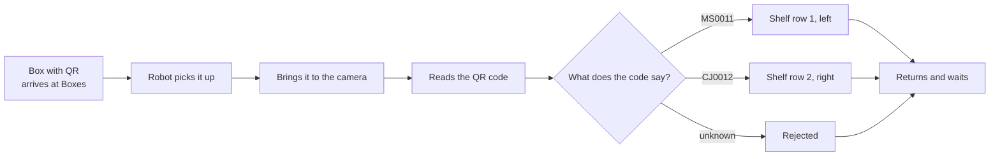
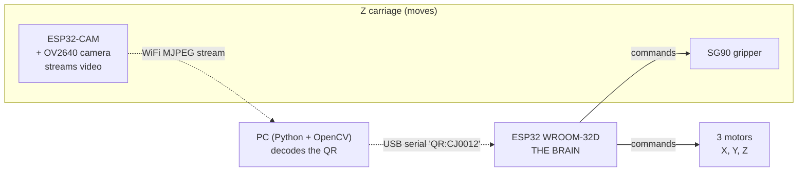
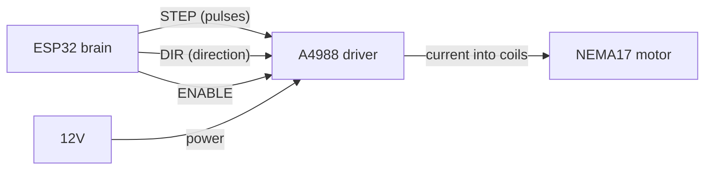
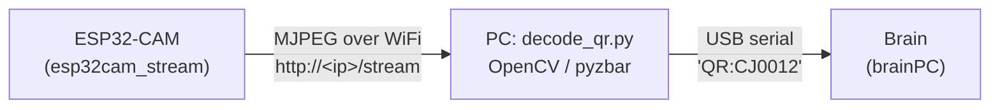
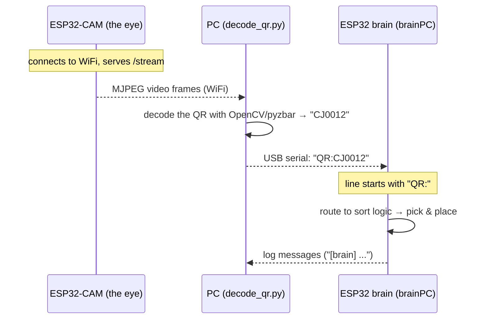
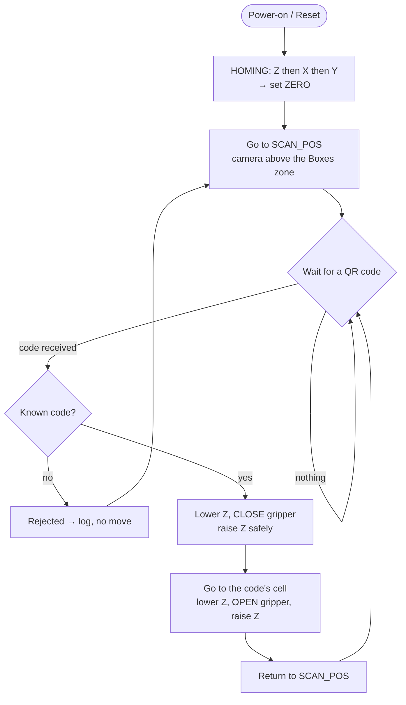

# Complete Guide — The QR Sorting Robot

> **Who this is for:** someone who already knows what voltage, a motor and a power supply are,
> but is not necessarily familiar with the ESP32, stepper motors, or how a robot "reads" a QR code.
> This guide takes the project from the idea, walks through every part, explains **how it works**,
> **how the parts communicate**, **how it decides** where each box goes, and — importantly —
> **why each design choice** was made and not another.
>
> This document describes the robot **as it is actually built** (not the original theoretical plan).
> The source of truth is the code in `firmware/` and `RUNNING.md`.

---

## Table of contents

1. [What the robot does, in short](#1-what-the-robot-does-in-short)
2. [The core idea: a Cartesian XYZ "arm"](#2-the-core-idea-a-cartesian-xyz-arm)
3. [The robot's two brains](#3-the-robots-two-brains)
4. [What an ESP32 is, and why ESP32 and not Arduino](#4-what-an-esp32-is-and-why-esp32-and-not-arduino)
5. [How it moves: stepper motors + A4988 drivers](#5-how-it-moves-stepper-motors--a4988-drivers)
6. [The coordinate system and "homing"](#6-the-coordinate-system-and-homing)
7. [The gripper (the hand that grabs the box)](#7-the-gripper-the-hand-that-grabs-the-box)
8. [The robot's eye: the camera and the QR code](#8-the-robots-eye-the-camera-and-the-qr-code)
9. [How the parts communicate (WiFi stream + USB serial)](#9-how-the-parts-communicate-wifi-stream--usb-serial)
10. [How the robot decides where to put the box](#10-how-the-robot-decides-where-to-put-the-box)
11. [The full flow, step by step (the state machine)](#11-the-full-flow-step-by-step-the-state-machine)
12. [Power: who gets which voltage](#12-power-who-gets-which-voltage)
13. [Pin map (reference)](#13-pin-map-reference)
14. [Design decisions and WHY](#14-design-decisions-and-why)
15. [Problems encountered and lessons learned](#15-problems-encountered-and-lessons-learned)

---

## 1. What the robot does, in short

Picture small boxes arriving in a feed area. Each box has a **QR code** stuck on it (the black-and-white
square, like a 2D barcode). The code says **where the box must go** — for example `MS0011`, `CJ0012`,
`EB0011`. The robot:

1. **picks** a box from the feed zone ("Boxes"),
2. **brings it in front of the camera** and **reads its QR code**,
3. **decides** which shelf cell it belongs to, based on the code,
4. **places it** in the correct cell,
5. **returns** and waits for the next box.

It is a **pick & place** robot with **automatic sorting by code**. Exactly what an automated warehouse
does, in miniature.



---

## 2. The core idea: a Cartesian XYZ "arm"

The robot is not an articulated arm with an "elbow" and "shoulder" like in the movies. It is much
simpler and more precise: a **Cartesian XYZ frame** (also called a *gantry*). Think of a 3D printer
or a CNC machine — same principle.

It has **3 axes**, each a straight rail along which a carriage slides back and forth:

- **X axis** — left ↔ right
- **Y axis** — front ↔ back
- **Z axis** — up ↔ down (raises/lowers the gripper)

By combining all 3, the tip of the robot (where the gripper and the camera sit) can reach **any point**
in the working volume, exactly like a point `(x, y, z)` in geometry. That is why it is called
"Cartesian": Cartesian coordinates.

**How is rotation turned into straight-line motion?** Each axis is a **screw actuator** (lead
screw / ballscrew): a motor turns a long screw, and a nut attached to the carriage cannot rotate, so
instead of spinning, it **advances** along the screw. Like a screw going into a nut held still by hand.
One full turn of the screw = the carriage advances by a fixed distance, called the **lead** (in our
case **4 mm per turn**).

```
   Motor turns  →  the screw turns  →  the nut (carriage) moves straight
   [MOTOR]========SSSSSSSSSSSSSSSSSSSS========>   (1 turn = 4 mm of travel)
                    ^nut attached to the carriage
```

Remember the number **4 mm/turn** — it comes back in the calibration section.

---

## 3. The robot's two brains

The robot has **two microcontrollers** (two "mini-computers"), each with its own job:

| Board | Role | What it does, concretely |
|---|---|---|
| **ESP32-CAM** (AI-Thinker) | **The eye** (vision node) | Has a camera. In our final design it just **streams the video** over WiFi. It moves nothing. |
| **ESP32 WROOM-32D** | **The brain** (state machine) | Drives the 3 motors, does the homing, moves the gripper, receives the code and decides where to put the box. |

There is also a **third actor**: a **PC** that does the actual QR decoding (see chapters 8 and 9).



**Why two boards and not one?** (important decision, detailed in chapter 14)
In short: the camera takes up almost all the pins of the ESP32-CAM, and image handling is heavy. If the
same board also had to generate the pulses for the motors (something *very* timing-sensitive), the
image work would "freeze" the motion and the motors would lose steps. **Separation of
responsibilities** = each part does its job without getting in the other's way.

---

## 4. What an ESP32 is, and why ESP32 and not Arduino

### What an ESP32 is

An **ESP32** is a **microcontroller** — a small chip that contains a processor, memory and a lot of
programmable **pins** that you can set HIGH (≈3.3 V) or LOW (0 V), read signals, generate pulses, etc.
It is like a "mini-computer" without a screen or keyboard, programmed by you (in the Arduino IDE, in
C/C++) to control electronics.

The ESP32 features that matter to us:
- **Built-in WiFi + Bluetooth** — essential, because the camera streams video over **WiFi**.
- **Two cores** (dual-core, 240 MHz) — it can do two things "in parallel".
- **Lots of memory** compared to classic microcontrollers — needed for handling the camera image.
- **Dedicated hardware peripherals** (RMT, LEDC) that generate pulses and PWM **without using the
  processor** — exactly what you need for the motors and the servo.
- **3.3 V logic** — the same voltage as the camera, so they "understand" each other directly.

### Why ESP32 and not Arduino (Uno)

The classic "Arduino" (Uno, with the ATmega328 chip) is great for getting started, but for this
project it would fall short:

| Criterion | Arduino Uno | ESP32 |
|---|---|---|
| Processor | 8-bit, 16 MHz | 32-bit, **240 MHz**, **2 cores** |
| RAM | 2 KB | ~520 KB (+ PSRAM on the CAM) |
| WiFi / radio | **No** | **Yes** (WiFi, ESP-NOW) |
| Camera / streaming | impossible (too little RAM) | yes (CAM variant) |
| Logic voltage | 5 V | 3.3 V (matches the camera) |
| Motor pulse generation | software, easily blocked | **hardware (RMT)**, very precise |

Concretely: a camera image and a WiFi video server **do not fit** in 2 KB of RAM, and without WiFi we
could not stream the picture to the PC. Plus, the two cores of the ESP32 leave one core for motion and
one for communication. That is why **ESP32 is the right choice here**, while a classic Arduino would
have blocked the project from the start.

> Note: the ESP32 is also programmed **from the Arduino IDE**, in the same language. "Arduino" is also
> a programming environment, not just a board — we use the Arduino environment, but on ESP32 boards.

---

## 5. How it moves: stepper motors + A4988 drivers

### The stepper motor (NEMA 17)

An ordinary (DC) motor spins continuously as long as you give it current — but you do not know *how
much* it has turned. A **stepper motor** is different: it rotates in **discrete, equal steps**. Our
model (NEMA 17, 1.8° per step) does **200 steps for one full turn** (360° / 1.8° = 200).

The big advantage: if I send it **exactly 200 pulses**, I know for sure it turned exactly one
revolution — without a position sensor. That makes it perfect for precise positioning (3D printers,
CNC, our robot). Control is "open loop": you count the steps, so you always know where you are (as long
as you do not lose steps due to excessive speed or insufficient torque).

### The A4988 driver

The ESP32 brain cannot power the motor directly (the motor needs a lot of current, ~1 A, while an ESP32
pin gives milliamps). Between them sits a **driver** — a small power amplifier. We use the **A4988**.

The brain sends it only **two simple signals**:
- **STEP** — one pulse = "take one step". 200 pulses = one revolution.
- **DIR** — HIGH/LOW level = "which way to turn" (forward/backward).

The driver translates these logic signals into the large current that actually moves the motor coils.
It also has an **ENABLE** pin (shared by all 3 drivers, active LOW) that turns the motor power on/off.



### Microstepping (half and quarter steps)

The driver can split one step into sub-steps (1/2, 1/4, ... 1/16) for finer and quieter motion.
**Our robot runs on full step**, set with the jumpers on the board.

### Calibration: "steps per millimeter"

The key question: **how many pulses must I send to move the carriage by 1 mm?**

```
steps_per_mm = (steps_per_turn × microstepping) / screw_lead_mm
             = (200 × 1) / 4 mm
             = 50 steps/mm
```

So **50 pulses = 1 mm**. To move the X axis by 100 mm, the brain sends 5000 pulses. The real value was
**verified in practice** (command 100 mm → measure with calipers → exactly 100 mm), so
`steps_per_mm = 50.0`.

### The FastAccelStepper library

Generating pulses with smooth acceleration, for 3 motors at once, is hard in pure software. We use the
**FastAccelStepper** library, which uses the ESP32's **RMT hardware peripheral**: the pulses are
produced by hardware, with perfect timing, without blocking the processor. This way the motors do not
lose steps even at high speed, and the moves have smooth acceleration/deceleration (gentle start and
stop, not abrupt).

---

## 6. The coordinate system and "homing"

### The problem: at power-on, the robot does not know where it is

When you power it up, the brain counts steps **from power-on**, but it has no idea where the carriage
physically is at that moment. It needs a **reference point (zero)**. That is what **homing** is for.

### The endstops (limit switches)

On each axis, at the ends, there are **microswitches** (endstops). When the carriage reaches the end,
it presses the switch → the brain "feels" that it hit the limit. We have **6 in total**: one at each end
(MIN and MAX) on each axis.

On our robot they are wired **NO (Normally Open)** with `INPUT_PULLUP`: at rest the pin is HIGH, and
when pressed it goes LOW ("pressed = LOW"). (The fail-safe ideal would be NC — see chapter 14.)

### The homing procedure (per axis)

To remove the mechanical "bounce" error, homing is done in 4 stages:

1. **Fast approach** toward the switch, until it touches it.
2. **Back off** a few mm (~4 mm).
3. **Slow re-approach** (3 mm/s) — much more precise.
4. On contact → **that is ZERO** for that axis.

### The order matters: Z → X → Y

Homing is done **on Z first**, then X, then Y. Why? So we **raise the gripper safely first** before
moving horizontally — otherwise it could hit the shelves.

A special detail on our robot: **Z homes UP** (toward the MAX switch, at the top), not down. Reason:
the shelves are in front, and if Z went down toward zero, the gripper would **hit the shelves**.
Important consequence for the coordinates:

> **`Z = 0` is at the TOP** (the safe, raised position). **Going down toward the shelves means
> NEGATIVE values** (e.g. `Z = -110 mm` = lowered onto a shelf).

### Software limits (soft limits)

Besides the physical switches, the brain also has **limits in the program**, so it never forces the end
of travel:

| Axis | Min | Max |
|---|---|---|
| X | 0 mm | 194 mm |
| Y | 0 mm | 170 mm |
| Z | −117 mm | 0 mm |

Any command outside these limits is automatically "clamped" to the safe value.

---

## 7. The gripper (the hand that grabs the box)

The gripper is a **two-jaw hand** that opens and closes, driven by an **SG90 servo motor** (a small,
cheap servo). Unlike an ordinary motor, you tell a servo **an angle** (0–180°) and it goes exactly
there.

The command is given via a **PWM** signal (pulses of a certain width) on pin GPIO19, generated by the
ESP32's **LEDC** hardware peripheral. In our case:
- **open** = 3° (releases the box),
- **closed** = 47° (grips the box; at 50° the servo "buzzes" and strains).

> **Power lesson:** the SG90 servo needs **solid, dedicated 5 V**. At 4.5 V it only "ticked" and looked
> broken, even though it was not. We put it on a separate 5 V supply, with a **common GND** with the
> ESP32. (See chapter 15.)

---

## 8. The robot's eye: the camera and the QR code

### What a QR code is and how the robot "sees" it

A **QR code** is a black-and-white image that encodes text (in our case: `MS0011`, `CJ0012`, etc.). The
**OV2640** camera on the ESP32-CAM board takes a picture, and a software algorithm finds the finder
patterns in the image, "straightens" the code and **decodes it into text**.

### The key decision: the PC decodes, not the camera

Originally the camera itself decoded the QR (with the `quirc` library, on the ESP32-CAM). It worked, but
the read rate was **too low** (often under 10%): the OV2640 has fixed focus and is light-sensitive, and
the small ESP32 is weak for image processing.

**The solution we settled on:** the camera does **no decoding**. It simply **streams the video** over
WiFi (an MJPEG server). A **PC** reads that stream and decodes the QR with **OpenCV / pyzbar** —
algorithms far more powerful than `quirc` on the tiny chip. The read accuracy went up dramatically.

In other words, the ESP32-CAM became a **wireless webcam**, and the "smart eye" moved to the PC.



### Practical details (still real challenges)

- **Fixed focus:** the OV2640 has no autofocus. It is sharp only at a **fixed distance** (~10–20 cm), so
  the gripper always brings the camera to the **same scan position** (`SCAN_POS`).
- **Light:** even, diffuse light works best, no glare. On GPIO4 there is a white LED that can provide
  steady illumination (tuned so it does not reflect off the glossy code).
- **Size/contrast:** the code must be printed clearly, large (≥25 mm), with a white quiet zone around it.
- **Robustness on the PC:** `decode_qr.py` tries `pyzbar` first, then falls back to OpenCV's
  `QRCodeDetector`, and catches the OpenCV errors on degenerate frames.

### The three files of this pipeline

| File | Runs on | Role |
|---|---|---|
| `firmware/esp32cam_stream/esp32cam_stream.ino` | ESP32-CAM | streams MJPEG over WiFi at `/stream` |
| `pc/decode_qr.py` | PC | reads the stream, decodes QR, sends `QR:<code>` over serial |
| `firmware/brainPC/brainPC.ino` | brain | receives `QR:<code>` over USB serial, runs the sort |

---

## 9. How the parts communicate (WiFi stream + USB serial)

This is one of the most interesting parts. There are **two links** in the chain, and the data flows
in one direction: camera → PC → brain.

### Link 1: camera → PC (WiFi, MJPEG video)

The ESP32-CAM connects to the WiFi network and starts a small **web server**. At the address
`http://<camera-ip>/stream` it serves an **MJPEG stream** (a continuous sequence of JPEG frames — like a
simple webcam). You can even open that address in a browser to check it.

The PC opens that stream with OpenCV (`cv2.VideoCapture(url)`), reads frame by frame, and decodes the QR.

### Link 2: PC → brain (USB serial cable)

When the PC decodes a code, it sends the brain a simple text line: `QR:CJ0012\n`, over the **USB serial**
cable. The same cable also carries:
- the brain's log messages back to the PC (so you see what it is doing),
- the commands you type (e.g. `HA`, `R1`, `P`), which the PC forwards to the brain.

On the brain, `brainPC.ino` looks at each incoming line: if it starts with `QR:`, it routes it into the
sort logic; anything else is treated as a normal console command.



**Why this split?** Decoding on the PC is far more accurate than on the ESP32-CAM, and the PC gives us a
live preview window for debugging. The camera, being just a streamer, needs **only power** — no data
wire to the moving Z carriage.

> Historical note: there was an earlier on-device variant where the ESP32-CAM decoded the QR itself and
> sent the code to the brain wirelessly over **ESP-NOW** (`firmware/esp32cam_qr_test` + `firmware/brain`).
> That still works as a standalone fallback, but the **PC-decode** pipeline above is the one we use,
> because of the much higher read accuracy.

---

## 10. How the robot decides where to put the box

### The shelves

The shelves are a grid of **3 rows × 2 columns**. Each cell has an associated code, and one cell is the
**feed zone** ("Boxes") where boxes are picked from:

| | Column 1 | Column 2 |
|---|---|---|
| **Row 1** | MS0011 | MS0012 |
| **Row 2** | CJ0011 | CJ0012 |
| **Row 3** | EB0011 | **Boxes** (boxes are picked here) |

`MS` = Mureș, `CJ` = Cluj, `EB` = (own label). The 2-letter prefix hints at the destination.

### The code → cell mapping (fixed strategy)

The robot has a **fixed table** in the program (`CODE_MAP`) that ties each code to an exact cell:

```
MS0011 → Row 1, Column 1
MS0012 → Row 1, Column 2
CJ0011 → Row 2, Column 1
CJ0012 → Row 2, Column 2
EB0011 → Row 3, Column 1
(any other code) → rejected, no movement
```

Each cell has **manually taught (x, y, z) coordinates** saved in the program. "Teaching" is done by
moving the robot by hand (via commands) to each spot and pressing "memorize here" (`T<slot>`).

> **Why a fixed mapping and not "first free cell"?** Because the set of codes is small and fixed → a
> direct mapping is **deterministic** (the box always lands in the same place, easy to verify and debug).

### Code validation

Before moving, the brain checks the format (known prefix + digits). Unknown codes are **rejected** — the
robot does nothing, so it does not make a mistake.

---

## 11. The full flow, step by step (the state machine)

The brain runs a **state machine**: one state → one action → the next state. Here is the full sort cycle
(the AUTO mode, `R1`, which lives in `brainPC.ino`):



Safety rules "sewn into" the logic:
- **Z always up before any X/Y move** — so it does not hit the shelves (the `raiseZBeforeXY` function).
- **Travel height** = `Z = −5 mm`, not 0 (because exactly at 0 the MAX switch is pressed).
- **Unknown / missing code** → rejected, the cycle does not get stuck.
- **A 5 s cooldown** after each sort, so the repeated detections in the stream do not loop the cycle.
- **STOP button** (`S` or `R0`) instantly stops the motion and the auto mode.

---

## 12. Power: who gets which voltage

The robot has several voltage "domains", which must be tied together by a **common GND**:

```
12V supply ─┬─ 12V → the 3 A4988 drivers (the motor power part) + 100µF cap/driver
            ├─ Buck 12V→3.3V → ESP32 brain + driver logic (3.3V)
            └─ dedicated 5V   → SG90 servo  (+ cap, so the voltage does not "sag")

ESP32-CAM ── powered separately over USB (clean 5V), from a laptop/power bank
             (the link is WiFi → the camera only wants power, no data wire)

⏚ COMMON GND between: supply, bucks, brain, drivers, servo. (The camera, being on WiFi,
  does NOT need a common GND with the brain.)
```

Why it matters:
- **The motors (12V) and the logic (3.3V)** are separate worlds — they only touch through the common GND.
- Without a **common GND**, the signals have no "reference" and nothing works correctly.
- **Capacitors** on the driver and servo supplies absorb the current spikes and prevent resets /
  "brownout".

---

## 13. Pin map (reference)

The real pins from `firmware/brainPC/brainPC.ino`:

| Function | GPIO | Notes |
|---|---|---|
| X STEP / DIR | 25 / 26 | pulses + direction, motor X |
| Y STEP / DIR | 32 / 33 | motor Y |
| Z STEP / DIR | 27 / 14 | motor Z |
| ENABLE (all 3 drivers) | 13 | active LOW |
| Endstop X / Y / Z — MIN (home) | 21 / 22 / 23 | `INPUT_PULLUP`, pressed = LOW |
| Endstop X / Y / Z — MAX (limit) | 4 / 18 / 17 | `INPUT_PULLUP` |
| SG90 gripper servo | 19 | PWM via LEDC, 50 Hz |
| QR codes input | USB serial | lines `QR:<code>` from the PC decoder |

> Microstepping (MS1/MS2/MS3) does **not** use pins — it is set with the jumpers on the A4988 board.

---

## 14. Design decisions and WHY

This is the "why we chose this and not that" chapter.

### 14.1 Two microcontrollers, not one
- **Why:** the camera takes up almost all the ESP32-CAM pins and image handling is heavy. Motor motion is
  timing-critical — it must never be interrupted by image work.
- **Solution:** one chip for vision (streaming), one chip for motion. Clean and robust.

### 14.2 ESP32, not classic Arduino
- **Why:** we need WiFi (radio), lots of RAM (camera image + web server), two cores, and hardware pulse
  generation. An Arduino Uno (2 KB RAM, no radio, 8-bit) can do none of those.

### 14.3 Decoding on the PC, not on the camera (the big one)
- **Why:** on-device decoding (quirc on the ESP32-CAM) gave a read rate often under 10% — the OV2640 is
  fixed-focus and the chip is weak for image processing.
- **Solution:** the camera only streams MJPEG over WiFi; the PC decodes with OpenCV/pyzbar (far more
  accurate) and sends `QR:<code>` to the brain over USB serial. Much higher reliability, plus a live
  debug window.

### 14.4 The on-device / ESP-NOW variant was abandoned
- **Why:** even with a wireless link (ESP-NOW) between camera and brain, the bottleneck was the **read
  accuracy** of the on-board decoder. The PC-decode pipeline solved exactly that. The ESP-NOW variant
  remains in the repo as a standalone fallback, but is not the one we use.

### 14.5 FastAccelStepper, not software AccelStepper
- **Why:** hardware timing (RMT) → no lost steps at high speed/microstepping. The 3 motors move
  simultaneously, smoothly, without loading the processor.

### 14.6 Fixed code→cell mapping (strategy A), not "first free" (B)
- **Why:** a small, fixed set of codes → a direct mapping is deterministic, easy to test and debug.

### 14.7 Z homes UP (toward MAX)
- **Why:** the shelves are in front; if Z homed down toward zero, the gripper would hit the shelves. So
  `Z = 0` is at the top (safe), and going down = negative values.

### 14.8 Positions "hardcoded", no non-volatile memory (NVS)
- **Why:** a simple "teach and paste" flow: move the robot, read the printed positions, paste them into
  the code and re-flash. For a prototype, simpler and more transparent than saving to NVS.

### 14.9 NO endstops (although NC would be ideal)
- **Why NC is ideal:** with NC, a broken wire reads as "limit hit" → the robot stops (fail-safe).
- **Why NO here:** the NC terminal of the switches we had did not work, so they were wired NO. A
  pragmatic, accepted decision.

### 14.10 A4988 drivers (below the motor's max current)
- **Why:** the motors are rated 1.7 A; the A4988 comfortably delivers ~1.1 A. For light loads (small
  boxes) that is enough; you add heatsinks and tune Vref. (A DRV8825 would give more, but the A4988 is
  what we have.)

---

## 15. Problems encountered and lessons learned

| Problem | Cause | Solution |
|---|---|---|
| Servo only "ticked", looked broken | weak supply (4.5 V) | **solid, dedicated 5 V** + common GND |
| Camera reset / shut down | weak USB or power bank with auto-off | good laptop USB / power bank without auto-off, 470µF cap |
| Low on-device QR read rate | fixed focus, weak chip | moved decoding to the **PC** (OpenCV/pyzbar) |
| Stream read fails intermittently | WiFi hiccup / client drop | `decode_qr.py` auto-reconnects to the stream |
| Repeated detections looped the cycle | stream sends the same code many times | 5 s cooldown after each sort (AUTO mode) |
| `endstop hit during move` on Z | `Z = 0` sits on the switch | travel at `Z = −5 mm`, not 0 |
| All endstops looked "pressed" | missing common GND | connected the common GND |
| Robot rebooted while teaching | name buffer too small (char[16]) | increased to char[24] |

---

### In summary

The robot is a **Cartesian XYZ gantry** driven by **stepper motors** through **A4988 drivers**,
commanded by an **ESP32 brain** that counts the steps and runs a **state machine**. A second board, the
**ESP32-CAM**, is the eye: it **streams the video over WiFi**. A **PC** decodes the QR with **OpenCV** and
sends the code to the brain over **USB serial**. The brain looks the code up in a **fixed table**, picks
the box from the Boxes zone and places it in the correct cell, then returns. Every design choice (two
boards, ESP32, PC-side decoding, Z homing up, the fixed mapping) was made for **reliability and
simplicity** — and many came from hands-on lessons at the bench.
</content>
