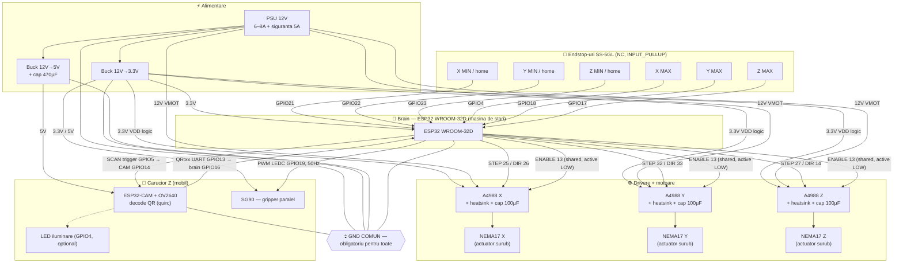

# Schemă bloc — robot de sortare QR (proiect complet)

Diagramă bloc a întregului sistem: alimentare 12V, cele două ESP32, driverele A4988,
motoarele NEMA17, endstop-urile MIN/MAX, gripper-ul SG90 și camera. Pinii corespund
pin map-ului din `CLAUDE.md` §4.

---

## 1. Schema bloc completă (hardware)



---

## 2. Tabel sinteză conexiuni (din §4)

| Bloc | Semnal | Pin brain | Pin destinatie | Tip |
|---|---|---|---|---|
| Motor X | STEP / DIR | 25 / 26 | A4988 X | iesire |
| Motor Y | STEP / DIR | 32 / 33 | A4988 Y | iesire |
| Motor Z | STEP / DIR | 27 / 14 | A4988 Z | iesire |
| Drivere | ENABLE (shared) | 13 | A4988 ×3 | iesire, active LOW |
| Endstop X/Y/Z MIN | home | 21 / 22 / 23 | switch NC → GND | `INPUT_PULLUP` |
| Endstop X/Y/Z MAX | limita | 4 / 18 / 17 | switch NC → GND | `INPUT_PULLUP` |
| Gripper | PWM | 19 | SG90 | LEDC 50Hz |
| CAM trigger | UART2 TX | 5 | CAM GPIO14 | `SCAN\n` |
| CAM date | UART2 RX | 16 | CAM GPIO13 | `QR:...\n` |
| LED status | optional | 2 | LED | iesire |

---

## 3. Magistrale de alimentare

```
PSU 12V ─┬─ VMOT A4988 ×3      (+ cap 100µF / driver)
         ├─ Buck 12V→3.3V ──── 3V3 brain + VDD logic drivere
         └─ Buck 12V→5V ────── 5V ESP32-CAM (+ cap 470µF)

⏚ GND COMUN între: PSU, ambele buck-uri, ambele ESP32, drivere, servo.
```

### Reguli cheie reflectate în schemă
- **VMOT 12V** și **logica 3.3V** sunt domenii separate, unite doar prin **GND comun**.
- **Cap 100µF** pe fiecare VMOT (protectie spike) + **470µF** pe CAM (anti-brownout).
- **ESP32-CAM pe 5V** prin LDO-ul de bord (mai stabil la inrush decat 3.3V direct).
- **Heatsink obligatoriu** pe fiecare A4988 la curentul folosit (~1.1A, Vref ~0.8–0.96V).
- **MS1/MS2/MS3** se seteaza din jumperi pe placa A4988 (nu pe GPIO).
