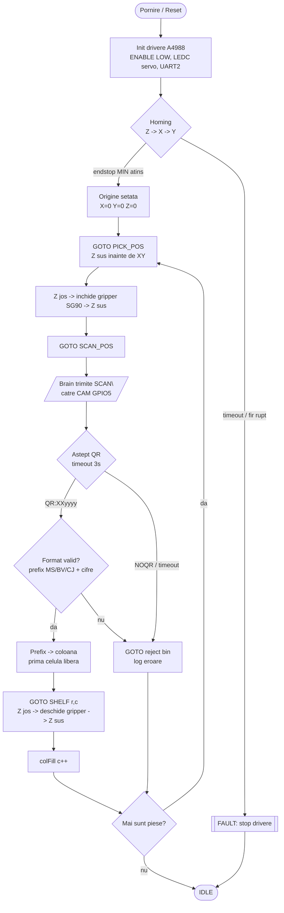
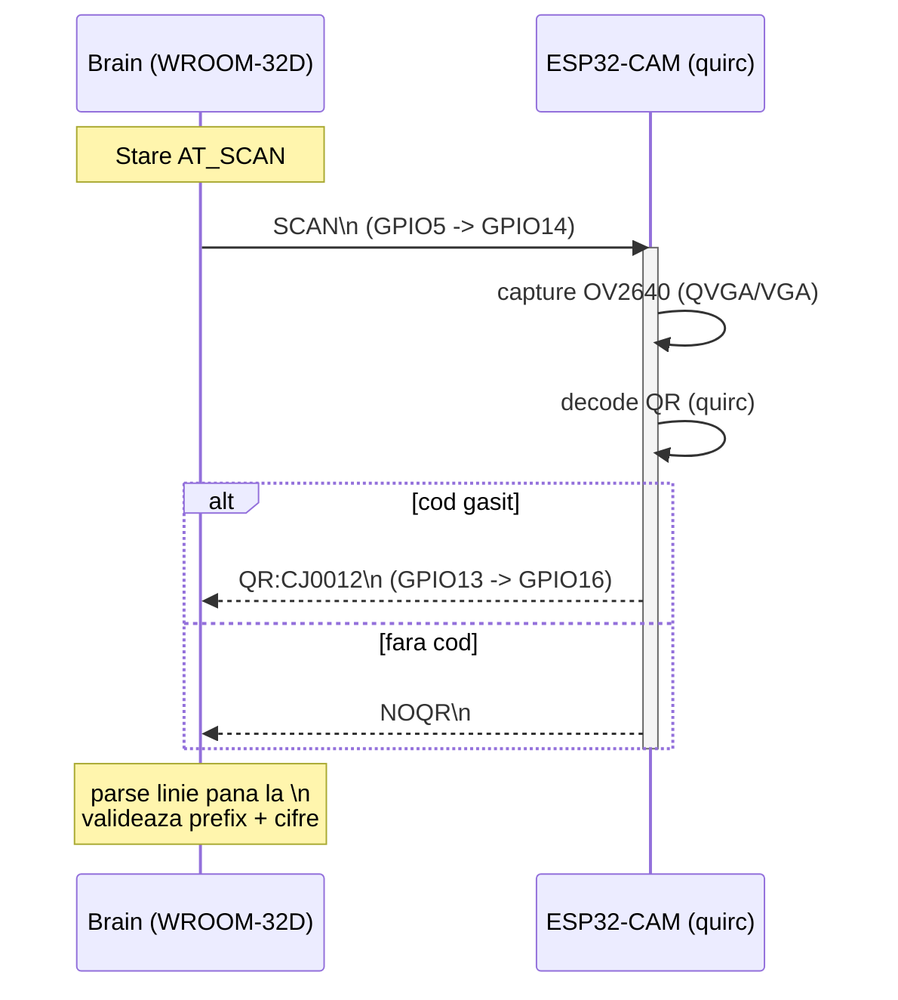
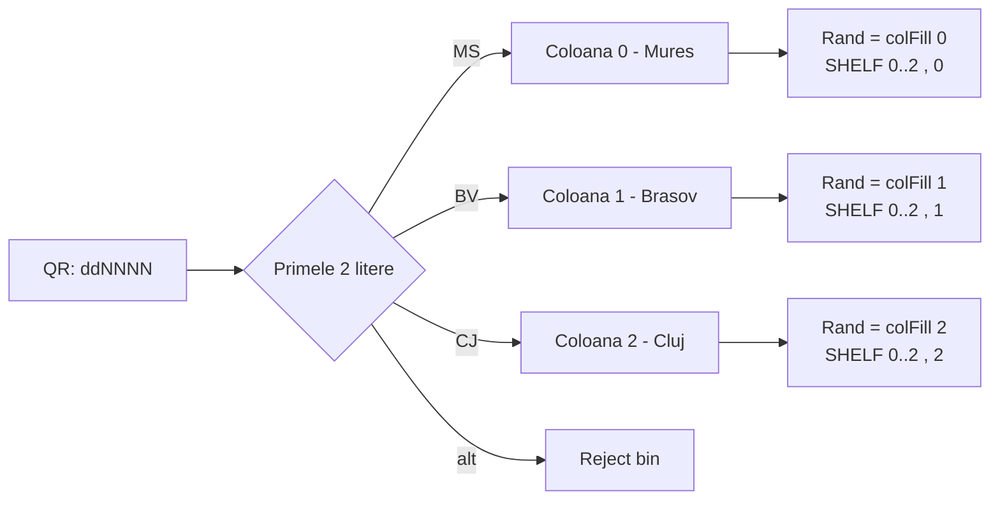

# Schemă logică de funcționare — robot de sortare QR

Diagrama fluxului operațional: de la pornire → homing → pick → scan QR → decizie → place → repetă.
Sunt implicate două plăci: **brain** (ESP32 WROOM-32D, mașina de stări) și **ESP32-CAM** (nod de viziune).

---

## 1. Fluxul logic complet (ciclu de sortare)

---

## 2. Schimbul serial brain ↔ ESP32-CAM (faza de scanare)

---

## 3. Maparea QR → raft (logica de sortare)

---

### Note de siguranță reflectate în logică
- **Z mereu sus** înainte de orice mișcare X/Y (anti-coliziune cu rafturile).
- **Homing** în ordinea Z→X→Y, cu fast approach → back-off → slow re-approach.
- **Endstop NC** + `INPUT_PULLUP`: fir rupt = HIGH = fault (fail-safe).
- **Timeout scanare** (3 s) → piesa merge în reject bin, nu blochează ciclul.
